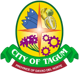
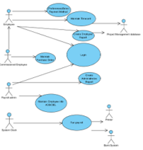

## LOCAL GOVERNMENT UNIT - TAGUM  

Drupal
>Framework used is Drupal is a CMS that uses Symfony as the web app framework

## Payroll Management system

> The method by which employers pay their employees' salaries using a payroll management system. 
>It's also how they show their commitment to their staff, meet their legal and ethical responsibilities, and maintain accurate financial records.
>- Employees can be added and deleted from the system. 
>- Employees can login through the system to record their time in/out for work and maintain their timecard
>- Employees can generate an employee report through the system
>- Employee admins can generate an admin report through the system
>- The employee's salaries can be paid to the employee based on the their payment method preference
>- The system communicates with the printer and bank system based on the system clock

>Case Diagram 

Sub-System
>

